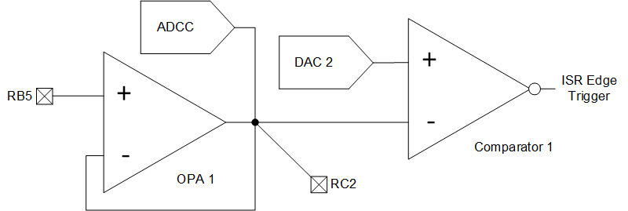
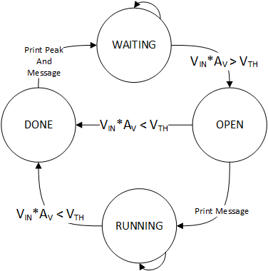

<!-- Please do not change this html logo with link -->

# Windowed Peak Detector with the PIC18F16Q41
The operational amplifier (OPA) module, along with a comparator, a digital-to-analog converter (DAC), and the analog-to-digital converter with computation (ADCC) can be used to implement a windowed peak detector. The windowed peak detector finds the highest voltage within a specific region of time or values. In this example, the window is defined by a voltage threshold.

## Related Documentation

<a href="https://www.microchip.com/wwwproducts/en/PIC18F16Q41">PIC18F16Q41 Product Information</a> 
TBxxxx, "Using Operational Amplifiers in PIC16 and PIC18" 
TBxxxx, "Optimizing Internal Operational Amplifiers for Analog Signal Conditioning" 
ANxxxx, "Analog Sensor Measurement and Acquisition"

## Software Used

* <a href="http://www.microchip.com/mplab/mplab-x-ide">MPLAB® IDE 5.40 or newer</a>
* <a href="https://www.microchip.com/mplab/compilers">Microchip XC8 Compiler 2.20 or newer</a>
* <a href="https://www.microchip.com/mplab/mplab-code-configurator">MPLAB® Code Configurator (MCC) 3.95.0 or newer</a>

## Hardware Used

* <a href="https://www.microchip.com/DevelopmentTools/ProductDetails/PartNO/DM164137"> Microchip Curiosity Development Board (DM164137) </a>
* *(Optional)* External Signal Source

## Setup

 

| Pin | Function
| --- | --------
| RC2 | OPA Module Output
| RC0 | Potentiometer Output on Curiosity
| RB7 | UART Output, 9600 BAUD
| RB5 | Signal Input (connect a signal or RC0 to this input)

#### Additional Pins

| Pin | Function
| --- | --------
| TX  | Curiosity UART to USB Transmit

## Operation
The windowed peak detector is a state machine that detects and measures signals that exceed a set threshold (set by DAC2). The signal input is amplified by 2 through the OPA module, which improves resolution for small signals and improves acquisition speed.

 The computation feature of the ADCC is used to generate an interrupt if the measured signal subtracted from the setpoint register (holding the previous peak) is greater than the 0. In this case, the measured signal is stored as the new high value in the setpoint register of the ADCC. The ADCC is continuously sampling (except when updating the setpoint register), which enables it detect relatively brief transient events that may occur during state transitions.

#### Accuracy and Precision
Generally this code example is accurate to about 15mV - the exact accuracy depends on the input signal characteristics and timing, such as when the event occurs during sampling.

#### Acquisition State Machine
 

On power-up the program starts in the WAITING state. When the output of the OPA module exceeds the threshold, then the program transitions to the OPEN state. In this state, the program prints the message "Peak Window Open" and moves to RUNNING. If the comparator detects an edge less than the threshold, then the program moves to DONE. In DONE, the program prints the peak value, resets the setpoint in the ADCC, and moves to WAITING.

Because brief events may change the flow of the state machine, this demo uses a next state to current state setup so that asynchronous events write to the next state of the machine, rather than the current state to reduce the chance of unexpected behavior.

## Signal Inputs
In the default configuration, the OPA module is configured as a non-inverting amplifier with a gain of 2. The gain can be changed in Microchip Code Configurator (MCC) for both smaller or larger signals.

**Important: The BW of the OPA module should be greater than the sampling frequency!**

#### Input range
The output of the OPA module should be kept below 4.096V, which is the limit of the ADCC's voltage reference. Using other voltage references with the ADCC will require changes to the way results are printed, as the output function expects 1mV per bit from the measurement.

## Summary
Using the PIC18F16Q41, it is possible to find the peak level of an input signal. This feature can be modified to act as fault sensor, using the same principle.
