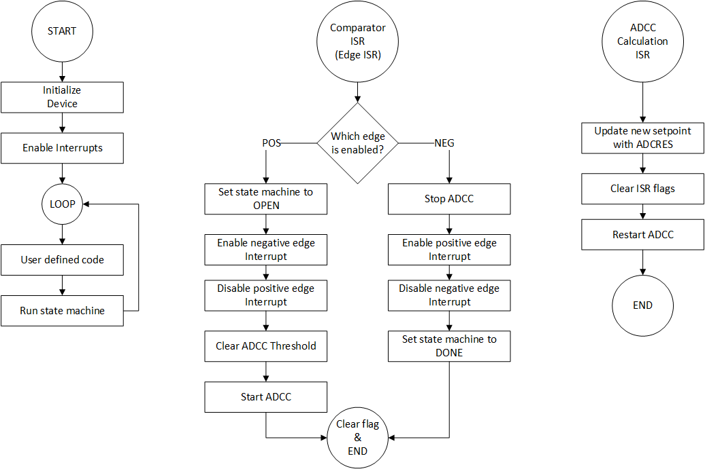

<!-- Please do not change this html logo with link -->

# Windowed Peak Detector with the PIC18F16Q41
The operational amplifier (OPA) module, along with a comparator, a digital-to-analog converter (DAC), and the analog-to-digital converter with computation (ADCC) can be used to implement a windowed peak detector.

## Related Documentation

<a href="https://www.microchip.com/wwwproducts/en/PIC18F16Q41">PIC18F16Q41 Product Information</a> 
TBxxxx, "Using Operational Amplifiers in PIC16 and PIC18" 
TBxxxx, "Optimizing Internal Operational Amplifiers for Analog Signal Conditioning" 
ANxxxx, "Analog Sensor Measurement and Acquisition"

## Software Used

* <a href="http://www.microchip.com/mplab/mplab-x-ide">MPLAB® IDE 5.40 or newer</a>
* <a href="https://www.microchip.com/mplab/compilers">Microchip XC8 Compiler 2.20 or newer</a>
* <a href="https://www.microchip.com/mplab/mplab-code-configurator">MPLAB® Code Configurator (MCC) 3.95.0 or newer</a>

## Hardware Used

* <a href="https://www.microchip.com/DevelopmentTools/ProductDetails/PartNO/DM164137"> Microchip Curiosity Development Board (DM164137) </a>
* *(Optional)* Signal Source

## Setup

 

| Pin | Function
| --- | --------
| RC2 | OPA Module Output
| RC0 | Potentiometer Output on Curiosity
| RB7 | UART Output, 9600 BAUD
| RB5 | Signal Input (connect a signal or RC0 to this input)

#### Special Pins

| Pin | Function
| --- | --------
| TX  | Curiosity UART to USB Transmit

## Operation
The windowed peak detector is a state machine that detects and measures signals that exceed a set threshold (set by DAC2). The signal input is buffered by the OPA module. In this code example, the OPA module is a unity gain buffer, however Microchip Code Configurator (MCC) can be used to change the operational amplifier configuration.

 On the rising edge of the signal exceeding the threshold, the comparator interrupt occurs, which enables the ADCC to start continuously sampling the output of the module. The computation feature of the ADCC is used to generate an interrupt if the measured signal subtracted from the setpoint register (holding the previous peak) is greater than the 0. In this case, the measured signal is stored as the new high value in the setpoint register of the ADCC.

 When the signal falls below the threshold, the ADCC is stopped and the peak value recorded is printed from the setpoint register.

#### Acquisition State Machine
 

On power-up the program starts in the WAITING state. In this state, the ADCC is off. When the output of the OPA module exceeds the threshold, then the program transitions to the OPEN state. In this state, the program prints the message "Peak Window Open" and moves to RUNNING. If a fast falling edge occurs before the transition to RUNNING, then the program will immediately switch to the DONE state and print the ending messages. Fast edges may be missed due to the speed of the edge.  

The program stays in the RUNNING state until the signal falls below the threshold. At this point, the program moves to DONE, and prints the peak value stored in the setpoint register of the ADCC.

(Note: Printing through UART is interrupt driven, making it asynchronous.)

#### Flowchart
 

#### Signal Inputs
In the default configuration, the OPA module is configured as a unity gain buffer, which has a gain of 1. To enable smaller input signals (such as those from sensors), the OPA module can be reconfigured in Microchip Code Configurator (MCC) to a higher gain using the internal resistor ladder.

## Summary
Using the peripherals included with the PIC18F16Q41, it is possible to do peak signal detection.
